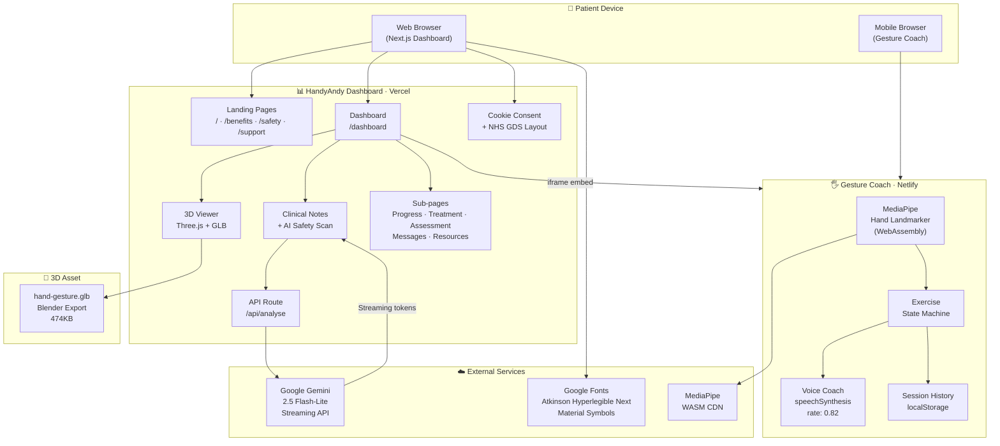
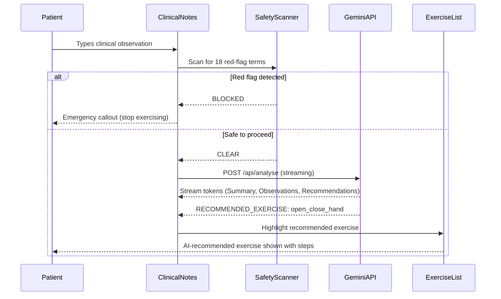
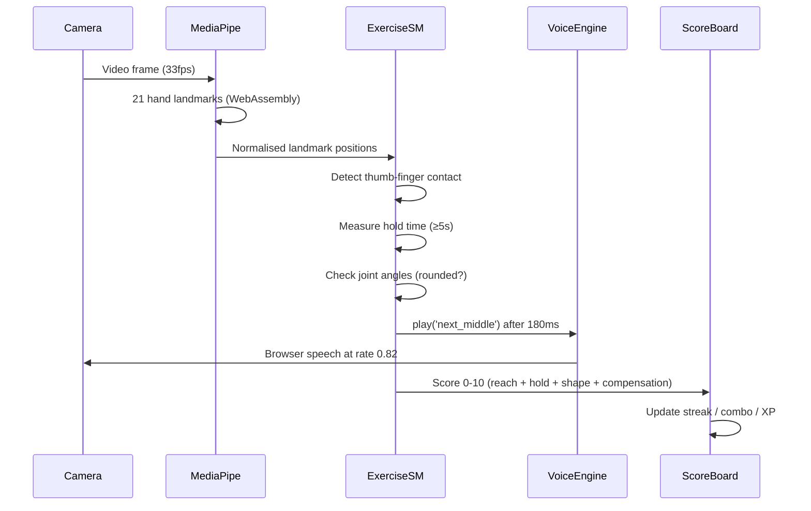

# 🖐️ HandyAndy

## NHS-Grade AI Hand Rehabilitation Platform

Turning clinician notes into personalised 3D exercise guidance — with live camera coaching, real-time AI analysis, and full NHS GDS compliance.

[](https://nextjs.org)
[](https://typescriptlang.org)
[](https://tailwindcss.com)
[](https://aistudio.google.com)
[](https://threejs.org)
[](https://mediapipe.dev)
[](https://service-manual.nhs.uk)
[](https://www.w3.org/WAI/WCAG22/Understanding/)
[](LICENSE)

---

[Live Demo](https://handyandy.vercel.app) · [Gesture Coach](https://gesture-coach.netlify.app) · [Report a Bug](https://github.com/oyagbileoluwaseun/HandyAndy/issues) · [Feedback](https://handyandy.vercel.app/feedback)

---

## 📋 Table of Contents

- [Overview](#overview)
- [The Problem](#the-problem)
- [Our Solution](#our-solution)
- [Key Features](#key-features)
- [System Architecture](#system-architecture)
- [Project Structure](#project-structure)
- [Tech Stack](#tech-stack)
- [Getting Started](#getting-started)
- [Environment Variables](#environment-variables)
- [NHS GDS Compliance](#nhs-gds-compliance)
- [Clinical Safety Standards](#clinical-safety-standards)
- [Contributing](#contributing)
- [Contributors](#contributors)
- [License](#license)

---

## Overview

HandyAndy is an NHS-grade digital hand rehabilitation platform built at VibeHack London 2026. It bridges the gap between in-clinic physiotherapy and at-home recovery by combining:

- **AI-powered clinical note analysis** — Gemini reads your physiotherapist's notes and extracts a personalised exercise plan
- **3D anatomical visualisation** — A Blender-built hand model shows exactly which joints to move and how
- **Real-time camera coaching** — MediaPipe hand-tracking watches your form and gives live voice feedback on your phone
- **Safety-first design** — 18 clinical red-flag terms are scanned before any AI analysis; emergency callouts override everything

> _"HandyAndy turns doctor notes into personalised 3D hand-rehab guidance, showing safe exercises, tracking progress, and flagging symptoms that need clinical attention."_

---

## The Problem

Every year, hundreds of thousands of NHS patients undergo hand and wrist surgery or injury rehabilitation. The standard discharge pathway gives them:

- A printed sheet of exercises with stick-figure diagrams
- An appointment in 4–6 weeks to check progress
- No feedback on whether they are doing the exercises correctly at home

### The result

Poor adherence, incorrect form, missed deterioration, and avoidable re-injury — all costing the NHS time and money, and costing patients their recovery.

---

## Our Solution

HandyAndy creates a **three-way clinical loop**:

```text
Clinician notes → AI extracts exercise plan → Patient follows 3D guided exercises
       ↑                                                        ↓
Progress data feeds back to clinician dashboard ← Camera scores every movement
```

Every piece of the system is designed to be:

- **Safe** — clinical safety scanning blocks exercise when red-flag symptoms are detected
- **Private** — no camera footage ever leaves the patient's device
- **Accessible** — full NHS GDS and WCAG 2.2 AA compliance
- **Free to use** — Gemini free tier, open-source hand tracking, no paywalls for patients

---

## Key Features

### 🧠 AI Clinical Notes Analysis

- Write or paste clinical observations into the notes field
- **Safety scan first**: 18 red-flag terms (numbness, discolouration, severe pain, etc.) are checked before any AI call — if found, the system blocks exercise and shows an emergency callout
- Gemini 2.5 Flash-Lite streams a structured clinical analysis in real time
- AI automatically extracts a `RECOMMENDED_EXERCISE` from the HandyAndy exercise library and highlights it in the checklist
- Regex fallback extraction works even when the AI is unavailable

### 🖐️ 3D Recovery Viewer

- Loads a real Blender-exported `.glb` hand animation via Three.js
- Bounce-loop animation (plays forward and back) with play/pause and scrubber controls
- NHS-blue dark background with anatomical grid overlay
- Ligament, nerve, and muscle overlay toggles
- Gracefully falls back to an NHS-styled SVG anatomical illustration if the model fails to load

### 📷 Gesture Coach (Live Camera Exercise Coaching)

- Companion Vite app using Google MediaPipe — runs **entirely on-device via WebAssembly**
- Supports 5 clinician-prescribed exercises: Thumb Opposition (Kapandji), IP Flexion, MCP Flexion, Abduction, Pinky Base Reach
- Scores every movement 0–10 for: reach distance, hold duration, joint shape (rounded vs clenched), and compensation
- Game mechanics: streaks, combo multipliers (×1.5 to ×3), XP levels, and daily goals
- Voice coaching at 0.82 rate with 180ms movement-response delay — speaks _after_ movement is detected, not before
- Priority-based cue system: corrections always override praise
- No audio uploaded — browser `speechSynthesis` only; optional ElevenLabs clips for better quality
- Camera footage **never uploaded** — all processing is local WebAssembly

### 📊 Recovery Dashboard

- Live progress strip updating in real time as exercises are ticked off
- 7-day pain sparkline (pure SVG) with trend indicator (improving / stable / worsening)
- Pain logger with GDS-compliant 44px thumb slider and colour-coded severity
- Mobility analysis panel with range-of-motion data
- Clinician message thread with compose functionality
- Recovery milestone tracker across 8-week programme phases

### 🍪 NHS Cookie Consent & Information Architecture

- Full NHS-style cookie consent banner on all pages except the homepage, with analytics toggle and GDPR-compliant localStorage persistence
- Complete set of NHS information pages: `/how-it-works`, `/benefits`, `/safety`, `/support`, `/feedback`
- Full dashboard sub-pages: `/progress`, `/treatment`, `/assessment`, `/resources`, `/messages`

---

## System Architecture

### High-Level System Diagram



### Data Flow — AI Clinical Analysis



### Data Flow — Gesture Coach Session



---

## Project Structure

```text
HandyAndy/
├── 📁 app/                          # Next.js App Router pages
│   ├── 📁 api/analyse/              # Gemini AI streaming endpoint
│   ├── 📁 dashboard/                # Protected patient dashboard
│   │   ├── layout.tsx               # Sidebar + header shell
│   │   ├── page.tsx                 # Main dashboard (exercise state)
│   │   ├── 📁 assessment/           # Clinical assessment data
│   │   ├── 📁 messages/             # Clinician messaging
│   │   ├── 📁 progress/             # Recovery charts & milestones
│   │   ├── 📁 resources/            # Exercise library & NHS guides
│   │   └── 📁 treatment/            # 4-phase treatment plan
│   ├── 📁 benefits/                 # Landing: Why HandyAndy
│   ├── 📁 feedback/                 # NHS GDS feedback form
│   ├── 📁 how-it-works/             # Landing: 5-step guide
│   ├── 📁 live-review/              # Gesture Coach embed page
│   ├── 📁 safety/                   # Medical disclaimer & red flags
│   ├── 📁 support/                  # FAQ & accessibility
│   ├── globals.css                  # NHS/GDS custom CSS
│   ├── layout.tsx                   # Root layout + CookiesBanner
│   └── page.tsx                     # Landing page
│
├── 📁 components/
│   ├── 📁 dashboard/                # Dashboard-specific components
│   │   ├── ClinicalNotes.tsx        # AI analysis + safety scanning
│   │   ├── ClinicianMessage.tsx     # Message card from physio
│   │   ├── ExerciseChecklist.tsx    # Tickable exercises + AI highlight
│   │   ├── MobilityAnalysis.tsx     # ROM metrics panel
│   │   ├── PainLogger.tsx           # Pain slider + log button
│   │   ├── PainSparkline.tsx        # SVG 7-day pain chart
│   │   ├── RecoveryProgressStrip.tsx# Live stats + progress bar
│   │   └── 📁 ThreeDViewer/
│   │       ├── ThreeDCanvas.tsx     # Three.js GLB renderer
│   │       ├── ThreeDViewer.tsx     # Viewer + overlays + CTA
│   │       ├── ViewerPlaceholder.tsx# NHS SVG anatomical fallback
│   │       └── LiveReviewButton.tsx # GDS Green CTA → Gesture Coach
│   ├── 📁 landing/                  # Landing page sections
│   │   ├── HeroSection.tsx          # NHS Blue hero + app mockup
│   │   └── LandingSections.tsx      # Benefits, HowItWorks, Safety, CTA
│   └── 📁 ui/                       # Shared NHS GDS components
│       ├── CookiesBanner.tsx        # NHS cookie consent banner
│       ├── GDSButton.tsx            # All button variants
│       ├── NHSFooter.tsx            # Standard GDS footer
│       ├── NHSHeader.tsx            # Sticky header, landing + dashboard
│       ├── NHSSidebar.tsx           # Patient portal sidebar nav
│       ├── PhaseBanner.tsx          # BETA banner → /feedback
│       └── StatusTag.tsx            # Status chips + WarningCallout
│
├── 📁 gesture-coach/                # Companion Vite app (Netlify)
│   ├── 📁 src/
│   │   ├── audio.ts                 # Voice coach (rate 0.82, 180ms delay)
│   │   ├── config.ts                # All tunable thresholds
│   │   ├── exercise.ts              # Kapandji opposition state machine
│   │   ├── exerciseModule.ts        # 4 calibrated exercise detectors
│   │   ├── genericSession.ts        # Game wrapper (points/streaks/combos)
│   │   ├── landmarks.ts             # Geometry helpers (angles, distances)
│   │   ├── main.ts                  # MediaPipe init + render loop
│   │   ├── storage.ts               # localStorage session history
│   │   ├── summary.ts               # Local rule-based coaching summary
│   │   └── ui.ts                    # DOM rendering
│   ├── index.html                   # GDS-styled HTML entry point
│   ├── package.json                 # @mediapipe/tasks-vision dep
│   └── vite.config.ts               # esnext target, mediapipe excluded
│
├── 📁 lib/
│   ├── constants.ts                 # All data, NHS colours, AI prompt,
│   │                                # exercises, safety flags, helpers
│   └── types.ts                     # All TypeScript interfaces
│
├── 📁 public/models/
│   └── hand-gesture.glb             # Blender 3D hand model (474KB)
│
├── middleware.ts                    # Passthrough (no auth)
├── next.config.js                   # ignoreBuildErrors, image domains
├── tailwind.config.ts               # Full NHS/GDS token system
├── .env.local.example               # Environment variable template
└── README.md                        # This file
```

---

## Tech Stack

### Dashboard (Next.js)

| Layer         | Technology                     | Purpose                       |
| ------------- | ------------------------------ | ----------------------------- |
| Framework     | Next.js 14.2.29 (App Router)   | Server + client rendering     |
| Language      | TypeScript 5.x                 | Type safety throughout        |
| Styling       | Tailwind CSS 3.4 + custom CSS  | NHS GDS design tokens         |
| 3D Rendering  | Three.js r168 + GLTFLoader     | Hand model viewer             |
| AI            | Google Gemini 2.5 Flash-Lite   | Streaming clinical analysis   |
| Design System | NHS GDS + GOV.UK Design System | Accessibility compliance      |
| Font          | Atkinson Hyperlegible Next     | Low-vision optimised          |
| Icons         | Material Symbols Outlined      | Variable icon font            |
| Hosting       | Vercel                         | Serverless Next.js deployment |

### Gesture Coach (Vite)

| Layer         | Technology                     | Purpose                    |
| ------------- | ------------------------------ | -------------------------- |
| Framework     | Vite 5.4 + TypeScript 5.6      | Browser-native SPA         |
| Hand Tracking | MediaPipe Tasks Vision 0.10.18 | 21-landmark hand detection |
| Runtime       | WebAssembly (WASM)             | On-device ML inference     |
| Voice         | Web Speech Synthesis API       | Coaching cues (rate: 0.82) |
| Storage       | localStorage                   | Session history            |
| Hosting       | Netlify (static)               | HTTPS for camera API       |

### Design & Assets

| Asset          | Tool                                                         | Details                    |
| -------------- | ------------------------------------------------------------ | -------------------------- |
| 3D Hand Model  | Blender                                                      | Exported as `.glb` (474KB) |
| Design System  | NHS Digital Service Manual                                   | All GDS tokens             |
| Typeface       | Google Fonts (Atkinson Hyperlegible Next)                    | NHS low-vision standard    |
| Colour Palette | NHS Blue `#005EB8`, NHS Green `#00703C`, GDS Black `#0B0C0C` |                            |

---

## Getting Started

### Prerequisites

- Node.js 18+ and npm
- A free Gemini API key from [aistudio.google.com](https://aistudio.google.com/apikey)
- Chrome or Edge (recommended for MediaPipe camera support)

### Installation

#### 1. Clone the repository

```bash
git clone https://github.com/oyagbileoluwaseun/HandyAndy.git
cd HandyAndy
```

#### 2. Set up the dashboard

```bash
npm install
# macOS / Linux / Git Bash:
cp .env.local.example .env.local
# Windows PowerShell:
# copy .env.local.example .env.local
```

Open `.env.local` and add your Gemini key:

```env
GEMINI_API_KEY=your-key-from-aistudio.google.com
NEXT_PUBLIC_GESTURE_COACH_URL=http://localhost:5174
```

#### 3. Start the dashboard

```bash
npm run dev
# → http://localhost:3000
```

#### 4. Start the Gesture Coach (second terminal)

```bash
cd gesture-coach
npm install
npm run dev
# → http://localhost:5174
```

---

## Environment Variables

| Variable                        | Required       | Where to get it                                                  | Description                                |
| ------------------------------- | -------------- | ---------------------------------------------------------------- | ------------------------------------------ |
| `GEMINI_API_KEY`                | ✅ Yes         | [aistudio.google.com/apikey](https://aistudio.google.com/apikey) | Free Gemini API key (no credit card)       |
| `NEXT_PUBLIC_GESTURE_COACH_URL` | ⚡ Recommended | Your Netlify deployment URL                                      | Points dashboard to the live Gesture Coach |

> **Privacy note:** `GEMINI_API_KEY` is server-only and never sent to the browser. The `NEXT_PUBLIC_` prefix on the Gesture Coach URL is intentional — it's just a URL, not a secret.

---

## NHS GDS Compliance

HandyAndy is built to the [NHS Digital Service Manual](https://service-manual.nhs.uk) and targets **WCAG 2.2 Level AA**.

| Standard        | Implementation                                               |
| --------------- | ------------------------------------------------------------ |
| Focus ring      | 3px `#FFDD00` outline on every focusable element             |
| Touch targets   | Minimum 44×44px on all interactive elements                  |
| Colour contrast | ≥ 4.5:1 on all body text; ≥ 3:1 on large text                |
| Typeface        | Atkinson Hyperlegible Next — designed for low-vision readers |
| Skip link       | "Skip to main content" on every page                         |
| ARIA            | `role`, `aria-label`, `aria-live`, `aria-current` throughout |
| Keyboard nav    | Full keyboard navigability, no keyboard traps                |
| Screen readers  | Semantic HTML, decorative images marked `aria-hidden`        |
| Spacing         | NHS 5px modular unit system (not 8px)                        |
| Border radius   | 0px (square) on all interactive elements per GDS             |
| Cookies         | NHS-standard consent banner on all non-home pages            |
| Phase banner    | BETA tag with feedback link on every page                    |

---

## Clinical Safety Standards

HandyAndy takes clinical safety seriously. These policies are **hard-coded** and cannot be overridden:

### Red-Flag Safety Scanning

Before any AI analysis, the clinical notes are scanned for 18 red-flag terms. If any are found, the system **blocks exercise** and shows an NHS-red emergency callout with 111/999 contact information. The AI is never called.

Red-flag terms include: `numb`, `numbness`, `blue`, `black`, `cold finger`, `no sensation`, `severe pain`, `can't move`, `cannot move`, `deformed`, `deformity`, `infection`, `pus`, `fever`, `swelling getting worse`, `paralysis`, `sudden weakness`, `pins and needles won't stop`.

### AI Boundaries

- Gemini is instructed to **never diagnose** and **never prescribe**
- AI output is labelled "AI Generated" and carries a disclaimer on every response
- AI recommends only from a pre-approved library of clinician-defined exercises
- Regex fallback extraction ensures a recommendation is always available, even when AI is unavailable

### Gesture Coach Safety

- The exercise calibration system personalises range of motion to **each patient's own comfortable range** — it does not use fixed clinical angles
- The `ease_back` voice cue fires as the highest priority when range limits are exceeded
- All measurements are labelled as "your-own-baseline trend data, not clinical joint angles"
- The disclaimer "Not a medical device" is displayed on every session page

### Privacy

- No camera footage is ever uploaded or stored
- All MediaPipe processing happens on-device via WebAssembly
- Session scores are stored only in browser `localStorage` for up to 90 days
- Patient data in the dashboard is demo data only — no real patient records are stored

---

## Contributing

Contributions are welcome. Please follow these standards:

### Code Standards

- **TypeScript** — all new files must be fully typed; avoid `any` unless unavoidable
- **NHS GDS** — all UI must use GDS design tokens from `tailwind.config.ts`; no custom colours outside the token system
- **Accessibility** — every interactive element needs a focus ring, aria-label, and 44px minimum touch target
- **Server/client split** — mark components `'use client'` only when they use hooks or browser APIs; keep pages as server components where possible
- **No auth** — the project is intentionally auth-free for the hackathon demo; do not add Clerk or any auth library

### Safety Standards

- Do not remove or weaken the red-flag safety scanning in `ClinicalNotes.tsx`
- Do not modify the AI system prompt to allow diagnosis or prescription
- Do not allow camera data to leave the user's device

### Commit Convention

```text
feat: add new exercise type to gesture coach
fix: hydration error in PainSparkline
docs: update deployment guide
style: fix missing focus ring on feedback form
chore: upgrade Gemini SDK
```

### Pull Request Process

1. Fork the repository
2. Create a feature branch: `git checkout -b feat/your-feature`
3. Commit your changes following the convention above
4. Push to your fork and open a pull request against `main`
5. Ensure your PR description explains the clinical/accessibility impact of any UI change

---

## Contributors

- **[Aryan Kaushik](https://github.com/aryankaushikdev)** — AI Integration · Blender Model · System Architecture
- **[Oluwaseun Oyagbile](https://github.com/oyagbileoluwaseun)** — NHS Dashboard · Design System · Clinical UX
- **[Theo](https://github.com/theo318)** — 3D Viewer · Gesture Coach · MediaPipe Integration

Built at the **VibeHack London Hackathon 2026** 🏥

---

## License

This project is licensed under the **MIT License** — see the [LICENSE](LICENSE) file for details.

HandyAndy is a hackathon prototype and is **not a regulated medical device**. It does not replace professional physiotherapy advice. Always follow the guidance of your NHS clinician.

---

Made with ❤️ for the NHS · VibeHack London 2026
